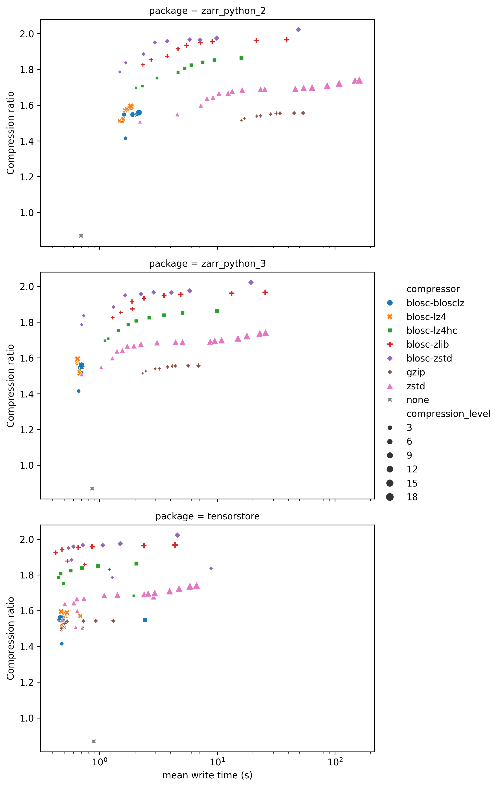
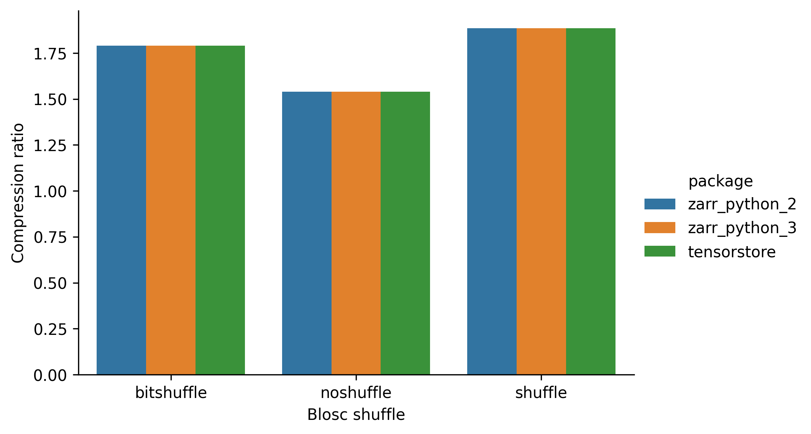

# Zarr benchmarks

This page contains the results of a small project benchmarking the best options to use when creating Zarr arrays.
[Zarr](https://zarr.dev/) is a specification for storing array data, allowing efficient operations on them for huge datasets.

When you create a Zarr dataset, there are two important options you can set: the chunk shape, and the compression algorithm.
What choices to make isn't obvious, hence this project.

## Summary

> Put top level recommendations here

## Compressors

### Write

### Read

### Shuffle

## Software libraries
