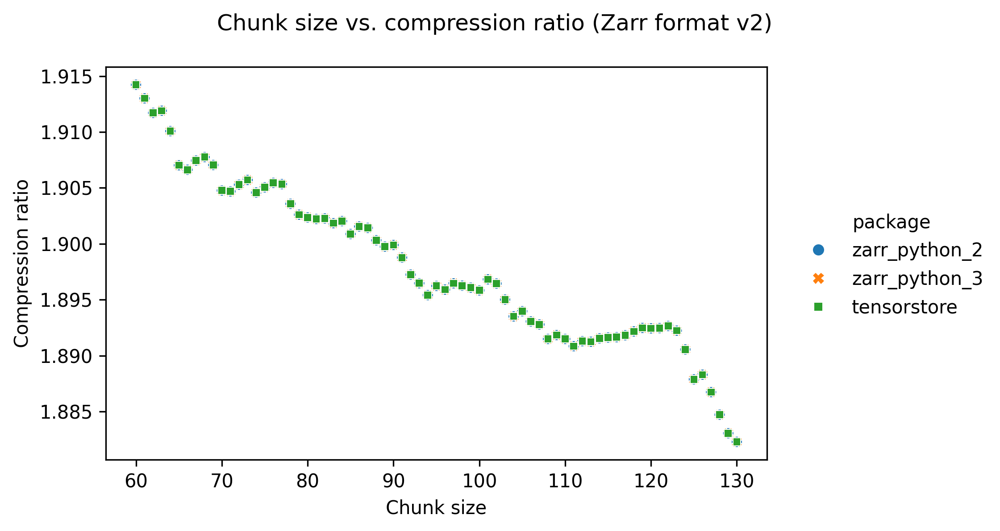
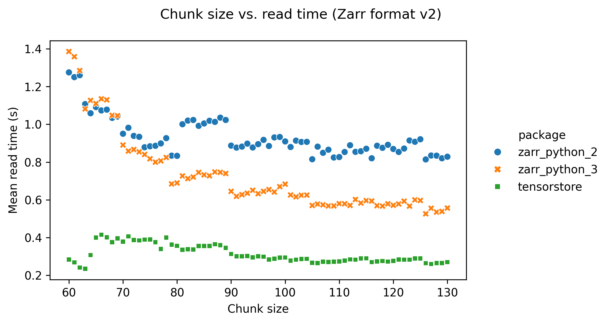
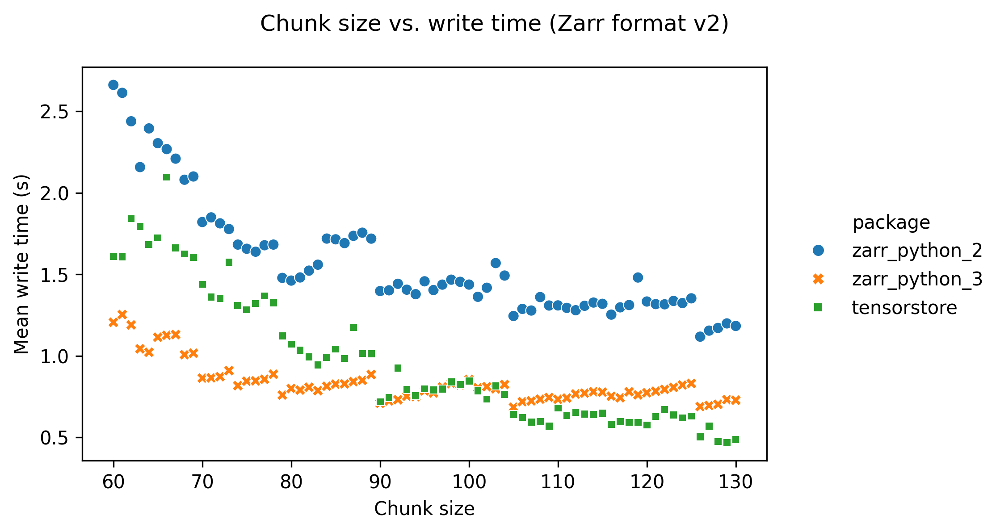

# Zarr benchmarks

## Introduction

This page contains benchmarks for the best options to use when creating Zarr
arrays.

[Zarr](https://zarr.dev/) is a specification for storing array data. When
creating a Zarr dataset there are several configuration options you can set,
which all have an impact on data compression, read times, and write times. This
project provides guidance on how array creation options affect data size and
read/write performance.

These benchmarks are part of the
[HEFTIE project](https://github.com/HEFTIEProject).

## Executive summary

- **Software**: _[tensorstore](https://google.github.io/tensorstore/)_ is faster
  than [_zarr-python_ version 3](https://zarr.readthedocs.io/en/stable/) is
  faster than [_zarr-python_ version 2](https://zarr.readthedocs.io/en/v2.18.5/)
  (for both reading and writing data).
- **Compressor**: _blosc-zstd_ provides the best compression ratio.
- **Compression level**: Setting compression levels beyond ~3 results in
  slightly better data compression but much longer write times. Compression
  level does not affect read time.
- **Other compressor options**: Setting the _shuffle_ option increases data
  compression with no adverse effect on read/write times.

## Configuration

Data used for benchmarking is available on
[Zenodo](https://doi.org/10.5281/zenodo.15544055).

### Datasets

All datasets have shape: 806 x 629 x 629, with a data type of _uint16_.

- **Image data**: A HiP-CT scan of a human heart.
- **Dense label data**: Segmented neurons from an electron microscopy volume of
  part of the human cerebral cortex.
- **Sparse label data**: Selected proofread segmented neurons, from the same
  dataset as the dense label data.

### Default configuration

Unless stated as being varied, the default configuration used was:

- **Dataset** = heart image data
- **Chunk size** = 128 x 128 x 128
- **Compressor** = blosc-zstd
- **Shuffle** = "shuffle"
- **Compression level** = 3
- **Zarr spec version** = 2

All benchmarks were run 5 times, and the mean values from these runs are shown
in the graphs below.

### Hardware

Reading and writing arrays was done to and from local SSD storage, to mimic real
world usage when reading/writing to/from a disk. This means times given are the
full time needed to read/write to/from disk.

## Compressors

This section shows how varying the compressor and it's configuration affects
performance.

### Compression algorithm & compression level

#### Write time

The following graph shows write time for the Zarr-python 2 library, with write
time on the x-axis and compression ratio on the y-axis. Each compressor is
represented with a different colour/symbol, and larger markers represent higher
compression levels. The compression level is the ratio of the data size when
loaded into memory (e.g., for an array with data type `uint8` and 16 elements,
the data size is 16 bytes), and the data size when compressed and stored. Higher
compression ratios mean lower stored data sizes.

The grey cross in the bottom left of he plot shows a baseline result for no
compression, taking about 0.7s. Perhaps surprisingly this has a compression
ratio slightly less than one. This is because the chunk boundaries don't line up
exactly with the data shape, so when written to Zarr some extra data at the
edges is written to pad the final chunks.

The quickest compressors on the left hand side of the graph took around 1 to 2
seconds, and already gave compression ratios of ~1.5. Increasing the compression
level typically increases the compression ratio at the cost of increased write
time. Increasing the compression level does not increase the compression ratio
by much - for _blosc-zstd_ going from ~1.8 and write times of 2 seconds to ~2.0
and write times of 50 seconds.

#### Read time

The following graph shows read time for the _zarr-python_ version 2 library,
with read time on the x-axis and compression ratio on the y-axis. Again, each
compressor is represented with a different colour/symbol, and larger markers
represent higher compression levels.

The grey cross in the bottom left of the plot shows a baseline result for no
compression, taking about 0.6 seconds.

For _zstd_ (pink triangles) read time increases with compression level. For all
other compressors there is no variation of read time with compression level. For
many compressors this is a feature of their design, with a large one-off cost of
compressing the data but no slow down in reading the data. All the compressors
have similar read times of around 1 second, apart from _zstd_ and _gzip_.

### Shuffle

In addition to setting the compression level, the blosc compressors also allow
configuring a "shuffle" setting. This ... _link out to description of shuffle_.

The following graphs show (in order) compression ratio, read time, and write
time for different values of shuffle for the _blosc-zstd_ codec (using the
tensorstore library).

 

Setting the _shuffle_ configuration to "shuffle" increases the compression ratio
from ~1.5 to ~1.9, and does not substatially change the read or write times.

### Chunk size

The following graphs show how changing the chunk size affects performance.

Increasing the chunk size decreases the compression ratio, but only slightly. This is probably because larger chunk sizes result in a bigger range data to compress per chunk, resulting in slightly less efficient compression.

Setting a low chunk size (below around 90) has an adverse effect on read and write times. This is probably because lower chunk sizes result in more files for the same array size, increaseing the number of file opening/closing operations that need to be done when reading/writing.

## Software libraries

The following graphs show the read time (x-axis) versus compression ratio
(y-axis) for the
[_zarr-python_ version 2](https://zarr.readthedocs.io/en/v2.18.5/),
[_zarr-python_ version 3](https://zarr.readthedocs.io/en/stable/), and
_[tensorstore](https://google.github.io/tensorstore/)_ libraries.

_tensorstore_ is consistently the fastest library when reading data.

The following graphs show the write time (x-axis) versus compression ratio
(y-axis) for the
[_zarr-python_ version 2](https://zarr.readthedocs.io/en/v2.18.5/),
[_zarr-python_ version 3](https://zarr.readthedocs.io/en/stable/), and
_[tensorstore](https://google.github.io/tensorstore/)_ libraries.

_tensorstore_ is consistently the fastest library when writing data.

## Zarr format version

## Type of data

Up to now, all results are from a 16-bit image dataset.
