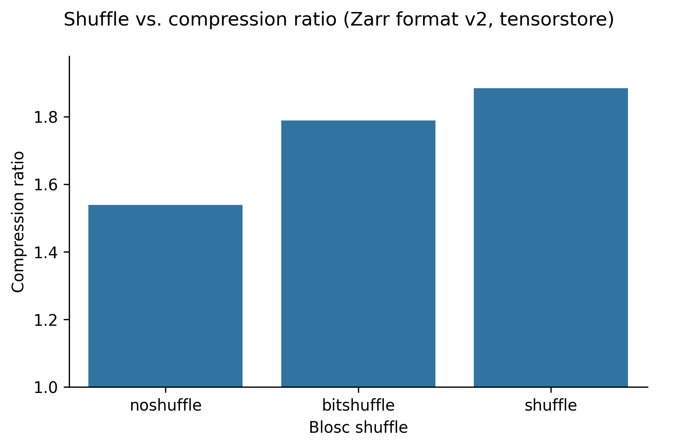
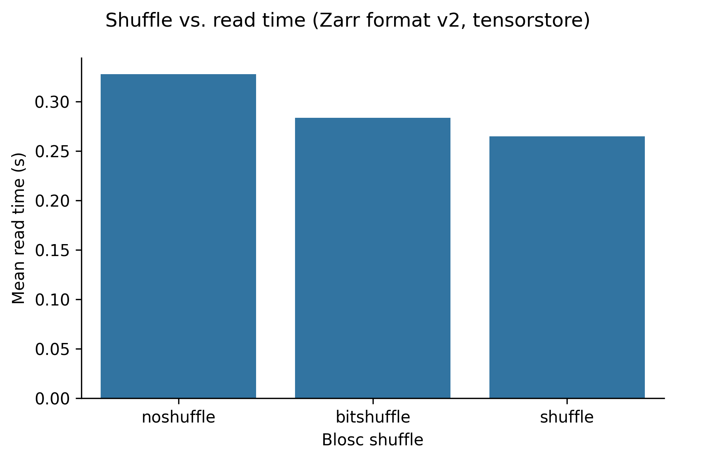

# Zarr benchmarks

## Introduction

This page contains benchmarks for the best options to use when creating Zarr
arrays.

[Zarr](https://zarr.dev/) is a specification for storing array data. When
creating a Zarr dataset there are several confugration options you can set,
which all have an impact on data compression, read times, and write times. This
project provides guidance on how array creation options affect data size and
read/write performance.

### Zarr versions

At the time of writing tools for working with version 3 of the Zarr array format
were still works in progress, so all testing was done reading/writing version 2
Zarr arrays. We expect performance to be similar when reading/writing version 3
Zarr arrays that are not sharded, because they should write identical data to
their corresponding version 2 Zarr array.

This is part of the [HEFTIE project](https://github.com/HEFTIEProject).

## Executive summary

- **Software**: _[tensorstore](https://google.github.io/tensorstore/)_ is faster
  than [_zarr-python_ version 3](https://zarr.readthedocs.io/en/stable/) is
  faster than [_zarr-python_ version 2](https://zarr.readthedocs.io/en/v2.18.5/)
  (for both reading and writing data).
- **Compressor**: _blosc-zstd_ provides the best compression ratio.
- **Compression level**: Setting compression levels beyond ~3 results in
  slightly better data compression but much longer write times. Compression
  level does not affect read time.
- **Other compressor options**: Setting the _shuffle_ option increases data
  compression with no adverse effect on read/write times.

## Configuration

Data used for benchmarking is available at
[https://doi.org/10.5281/zenodo.15544055]().

### Dense image data

- **Image data**: A **(shape)** shaped image of a human heart with _uint16_ data
  type.
- **Dense label data**: A **(shape)** shaped **description** with **dtype** data
  type.
- **Sparse label data**: A **(shape)** shaped **description** with **dtype**
  data type.

### Default configuration

Unless stated as being varied, the default confugration used was:

- **Chunk size** = 128 x 128 x 128
- **Compressor** = blsoc-zstd
- **Shuffle** = "shuffle"
- **Compression level** = ???

## Compressors

This section shows how varying the compressor and it's confguration affects
performance.

### Compression algorithm & compression level

#### Write speed

The following graph shows write speed for the Zarr-python 2 library, with write
time on the x-axis and compression ratio on the y-axis. Each compressor is
represented with a different colour/symbol, and larger markers represent higher
compression levels.

The grey cross in the bottom left of the plot shows a baseline result for no
compression, taking about 0.7s. Perhaps surprisingly this has a compression
ratio slightly less than one. This is because the chunk boundaries don't line up
exactly with the data shape, so when written to Zarr some extra data at the
edges is written to pad the final chunks.

The quickest compressors on the left hand side of the graph took around 1 to 2
seconds, and already gave comression ratios of ~1.5. Increasing the compression
level typically increases the compression ratio at the cost of increased write
time. Increasing the compression level does not increase the compression ratio
by much - for _blosc-zstd_ going from ~1.8 and write times of 2 seconds to ~2.0
and write times of 50 seconds.

#### Read speed

The following graph shows read speed for the _zarr-python_ version 2 library,
with read time on the x-axis and compression ratio on the y-axis. Again, each
compressor is represented with a different colour/symbol, and larger markers
represent higher compression levels.

The grey cross in the bottom left of the plot shows a baseline result for no
compression, taking about 0.6 seconds.

For _zstd_ (pink triangles) read time increases with compression level. For all
other compressors there is no variation of read time with compression level. For
many compressors this is a feature of their design, with a large one-off cost of
compressing the data but no slow down in reading the data. All the compressors
have similar read times of around 1 second, apart from _zstd_ and _gzip_.

### Shuffle

In addition to setting the compression level, the blosc compressors also allow
configuring a "shuffle" setting. This ... _link out to description of shuffle_.

The following graphs show (in order) compression ratio, read time, and write
time for different values of shuffle for the _blosc-zstd_ codec.

 

Using setting the _shuffle_ confguration to "shuffle" increases the compression
ratio from ~1.5 to ~1.9, and does not substatially change the read or write
times.

### Chunk size

## Software libraries

The following graphs show the read time (x-axis) versus compression ratio
(y-axis) for the
[_zarr-python_ version 2](https://zarr.readthedocs.io/en/v2.18.5/),
[_zarr-python_ version 3](https://zarr.readthedocs.io/en/stable/), and
_[tensorstore](https://google.github.io/tensorstore/)_ libraries.

_tensorstore_ is consistently the fastest library when reading data.

The following graphs show the write time (x-axis) versus compression ratio
(y-axis) for the
[_zarr-python_ version 2](https://zarr.readthedocs.io/en/v2.18.5/),
[_zarr-python_ version 3](https://zarr.readthedocs.io/en/stable/), and
_[tensorstore](https://google.github.io/tensorstore/)_ libraries.

_tensorstore_ is consistently the fastest library when writing data.
