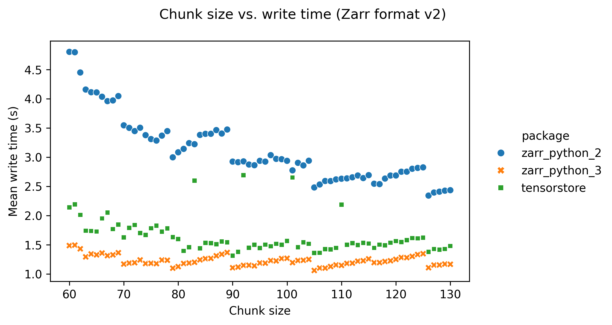
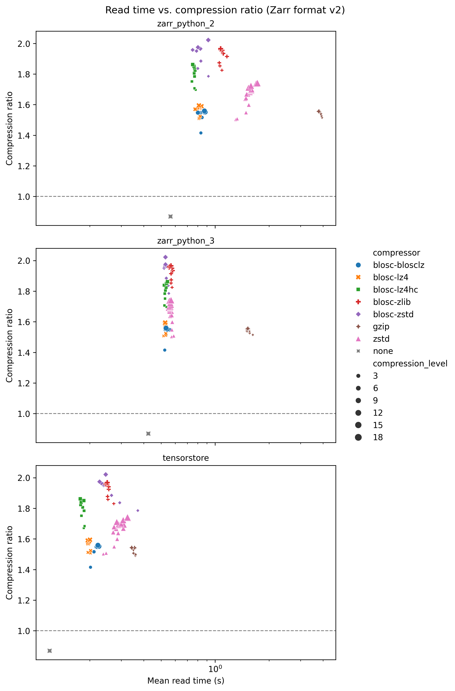
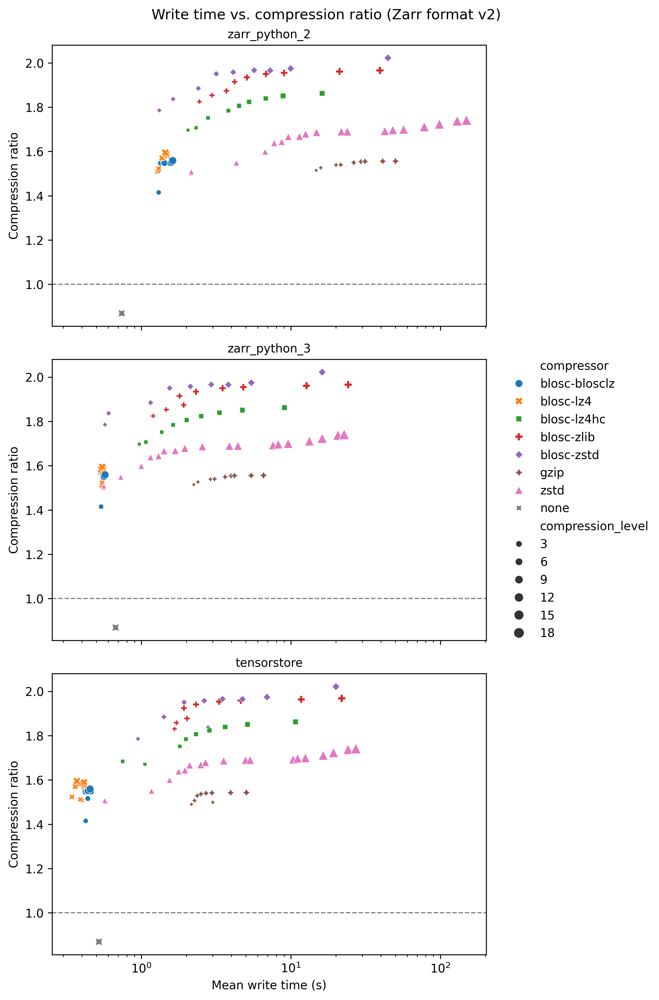
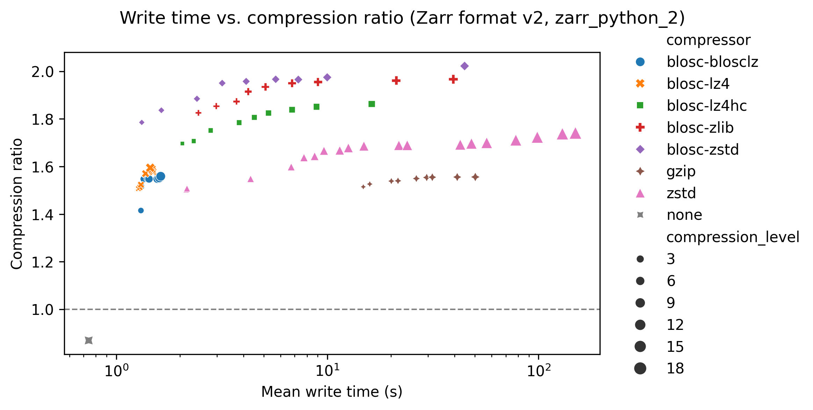

# Zarr benchmarks

This page provides advice on how to set [Zarr](https://zarr.dev/) array
configuration options. These options all have an impact on data compression,
read times, and write times. The advice here is based on a series of benchmarks,
which are presented below.

These benchmarks are part of the wider
[HEFTIE project](https://github.com/HEFTIEProject).

## Executive summary

- **Software**: _[tensorstore](https://google.github.io/tensorstore/)_ is faster
  than [_zarr-python_ version 3](https://zarr.readthedocs.io/en/stable/) is
  faster than [_zarr-python_ version 2](https://zarr.readthedocs.io/en/v2.18.5/)
  (for both reading and writing data).
- **Compressor**:
  - `blosc-zstd` provides the best compression ratio for image and sparse
    segmentation data
  - `zstd` provides the best compression ratio for dense segmentation data.
- **Compression level**: Values greater than ~3 result in slightly better data
  compression but much longer write times. Compression level does not affect
  read time.
- **Other compressor options**: Setting the `shuffle` option has no adverse
  effect on read/write times, and for different data types different values
  increase compression ratio:
  - image data, setting it to `"shuffle"`
  - sparse labels, setting it to `"bitshuffle"`
  - dense labels not setting `shuffle` at all

## Configuration

The data used for benchmarking is available on Zenodo at
[10.5281/zenodo.15544055](https://doi.org/10.5281/zenodo.15544055).

### Datasets

All datasets have shape: 806 x 629 x 629, with a 16-bit unsigned integer data
type. Three different datasets were used:

- **Image data**:
  [A Hierarchical Phase-Contrast Tomography (HiP-CT) scan of a human heart.](https://doi.org/10.15151/ESRF-DC-1773966241)
- **Dense label data**: Segmented neurons from an
  [electron microscopy volume of part of the human cerebral cortex](https://h01-release.storage.googleapis.com/data.html).
- **Sparse label data**: Selected proofread segmented neurons, from the
  [same dataset as the dense label data](https://h01-release.storage.googleapis.com/data.html).

### Default configuration

Unless stated as being varied below, the default Zarr array configuration used
was:

- **Dataset** = heart image data
- **Chunk shape** = `(128, 128, 128)`
- **Compressor** = `"blosc-zstd"`
- **Shuffle** = `"shuffle"`
- **Compression level** = `3`
- **Zarr specification version** = 2

All benchmarks were run 5 times, and the mean values from these runs are shown
in the graphs below.

### Hardware

Reading and writing arrays was done to and from local SSD storage, to mimic real
world usage when reading/writing to a disk. Times given are the full time needed
to read/write to/from disk.

Benchmarking result data used to create this report is available in the
[HEFTIEProject/zarr-benchmarks](https://github.com/HEFTIEProject/zarr-benchmarks)
repository in the `/example_results` directory. To reproduce the plots in this
report locally (along with further plots we couldn't include in the report), see
the README in that repository.

## Compressors

This section shows how varying the compressor and it's configuration affects
performance.

### Compression algorithm & compression level

#### Write time

The following graph shows write time for the Zarr-python 2 library, with write
time on the x-axis and compression ratio on the y-axis. Each compressor is
represented with a different colour/symbol, and larger markers represent higher
compression levels. The compression ratio is the ratio of the data size when
loaded into memory (e.g., for an array with 16 bit unsigned integer data type
and 16 elements, the data size is 32 bytes), and the data size when compressed
and stored. Higher compression ratios mean lower stored data sizes.

The grey cross in the bottom left of he plot shows a baseline result for no
compression, taking about 0.7s. Perhaps surprisingly this has a compression
ratio slightly less than one. This is because the chunk boundaries don't line up
exactly with the data shape, so when written to Zarr some extra data at the
edges is written to pad the final chunks.

The quickest compressors on the left hand side of the graph took around 1 to 2
seconds, and already gave compression ratios of ~1.5. Increasing the compression
level typically increases the compression ratio at the cost of increased write
time. Increasing the compression level does not increase the compression ratio
by much - for _blosc-zstd_ going from ~1.8 and write times of ~1 second to ~2.0
and write times of ~45 seconds.

#### Read time

The following graph shows read time for the _zarr-python_ version 2 library,
with read time on the x-axis and compression ratio on the y-axis. Again, each
compressor is represented with a different colour/symbol, and larger markers
represent higher compression levels.

The grey cross in the bottom left of the plot shows a baseline result for no
compression, taking about 0.6 seconds.

For _zstd_ (pink triangles) read time increases with compression level. For all
other compressors there is no variation of read time with compression level. For
many compressors this is a feature of their design, with a large one-off cost of
compressing the data but no slow down in reading the data. All the compressors
have similar read times of around 1 second, apart from _zstd_ and _gzip_ which
have significantly slower read times.

### Shuffle

In addition to setting the compression level, the blosc compressors also allow
configuring a "shuffle" setting. This includes
[shuffle, noshuffle and bitshuffle](https://www.blosc.org/python-blosc/tutorial.html#using-different-filters).

The following graphs show (in order) compression ratio, read time, and write
time for different values of shuffle for the _blosc-zstd_ codec (using the
tensorstore library).

Setting the _shuffle_ configuration to "shuffle" increases the compression ratio
for imagaing data from ~1.5 to ~1.9, and does not substatially change the read
or write times. We found that different shuffle options have different outcomes
for different types of data however.

### Chunk size

The following graphs show how changing the chunk size affects performance.

Increasing the chunk size decreases the compression ratio, but only slightly.
This is probably because larger chunk sizes result in a bigger range of data to
compress per chunk, resulting in slightly less efficient compression.

Setting a low chunk size (below around 90) has an adverse effect on read and
write times. This is probably because lower chunk sizes result in more files for
the same array size, increasing the number of file opening/closing operations
that need to be done when reading/writing.

## Software libraries

The following graphs show how the software package used affects performance.
Benchmarks were run with the
[_zarr-python_ version 2](https://zarr.readthedocs.io/en/v2.18.5/),
[_zarr-python_ version 3](https://zarr.readthedocs.io/en/stable/), and
_[tensorstore](https://google.github.io/tensorstore/)_ libraries.

_tensorstore_ is consistently the fastest library when both reading and writing
data.

## Zarr format version

Although not shown here with graphs, we found that the difference between
reading and writing Zarr format 2 and Zarr format 3 data with otherwise
identical settings was negligible.

## Different image types

Up to now, all results are from a 16-bit CT image dataset of a heart. The
following graphs show the compression ratio - write time plots for the original
heart dataset (top), a dense segmentation (middle), and a sparse segmentation
(bottom).

For the sparse segmentation (bottom panel) again the "blosc-zstd" compressor
provides the best compression ratios, but the effect of choosing a different
compressor is even more pronounced. For the dense segmentation (middle panel)
the "zstd" compressor provides the best results. With the dense segmentation
compression ratios for blosc-zstd reach around 60, whereas for the sparse
segmentation compression levels of over 2,000 are reached.
